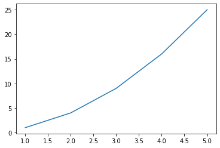

## Matplotlib 시작하기

### 파이썬의 데이터 시각화 라이브러리

- matplotlib
- %matplitlib inline을 통해 활성화


cf) 라이브러리(라이브러리들을 조합해서 결과물 완성) vs 프레임워크(이미 틀이 짜여있고, 내용물을 채워가며 결과물 완성)


```python
import numpy as np
import pandas as pd
import matplotlib.pyplot as plt

%matplotlib inline
```

### Case Study with Arguments


```python
plt.plot([1, 2, 3, 4, 5])# 실제 plotting을 하는 함수 # y = x + 1 # x = index, y = [1, 2, 3, 4, 5]
plt.show()# plt를 확인하는 명령
```


    

    


```python
plt.plot([2, 4, 2, 4, 2])
plt.show()# plt를 확인하는 명령
```


    

    


#### figsize : figure(도면)의 크기 조절


```python
plt.figure(figsize=(6, 6))# plotting을 할 도면을 선언
plt.plot([0, 1, 2, 3, 4])
plt.show()
```


    

    


```python
plt.figure(figsize=(3, 3))# plotting을 할 도면을 선언
plt.plot([0, 1, 2, 3, 4])
plt.show()
```


    

    


### 2차함수 그래프 with plot()


```python
# 리스트를 이용해서 1차함수 y = x를 그려보면:
plt.plot([0, 1, 2, 3, 4])

plt.show()
```


    

    


```python
# numpy.array를 이용해서 함수 그래프 그리기

x = np.array([1, 2, 3, 4, 5])# 정의역
y = np.array([1, 4, 9, 16, 25])# f(x)

plt.plot(x, y)
plt.show()
```


    

    


```python
# np.arange(a, b, c) c: 0.01

x = np.arange(-10, 10, 0.01)
plt.plot(x, x**2)
plt.show()
```


    

    


```python
# x, y축에 설명 추가하기

x = np.arange(-10, 10, 0.01)

#######
plt.xlabel("x value")
plt.ylabel('f(x) value')
#######
plt.plot(x, x**2)

plt.show()
```


    

    


```python
# x, y축의 범위를 설정하기

x = np.arange(-10, 10, 0.01)


plt.xlabel("x value")
plt.ylabel('f(x) value')
####
plt.axis([-5, 5, 0, 25]) # [x_min, x_max, y_min, y_max]
####
plt.plot(x, x**2)

plt.show()
```


    

    


```python
# x, y축에 눈금 설정하기

x = np.arange(-10, 10, 0.01)


plt.xlabel("x value")
plt.ylabel('f(x) value')
plt.axis([-5, 5, 0, 25]) # [x_min, x_max, y_min, y_max]
####
plt.xticks([i for i in range(-5, 6, 1)])
plt.yticks([i for i in range(0, 25, 3)])
####
plt.plot(x, x**2)

plt.show()
```


    

    


```python
# 그래프에 title 달기

x = np.arange(-10, 10, 0.01)


plt.xlabel("x value")
plt.ylabel('f(x) value')
plt.axis([-5, 5, 0, 25]) # [x_min, x_max, y_min, y_max]
plt.xticks([i for i in range(-5, 6, 1)])
plt.yticks([i for i in range(0, 25, 3)])
####
plt.title('y = x^2 graph')
####
plt.plot(x, x**2)

plt.show()
```


    

    


```python
# 그래프에 title 달기

x = np.arange(-10, 10, 0.01)


plt.xlabel("x value")
plt.ylabel('f(x) value')
plt.axis([-5, 5, 0, 25]) # [x_min, x_max, y_min, y_max]
plt.xticks([i for i in range(-5, 6, 1)])
plt.yticks([i for i in range(0, 25, 3)])
plt.title('y = x^2 graph')
####
plt.plot(x, x**2, label='trend')
plt.legend()# plot의 label과 관련된 항목이기 때문에 반드시 그래프가 그려진 다음에 선언해줘야 한다.
####
plt.show()
```


    

    


### 꺽은선 그래프(Plot)
- 시계열(시간) 관련 그래프에서 많이 사용
- plot()


```python
x = np.arange(20)# 0~19
y = np.random.randint(0, 20, 20)# 난수를 20번 생성

plt.plot(x, y)

# Extra : y축을 20까지 보이게 하고 싶다면?, y축을 '5'단위로 보이게 하고 싶다면?
plt.axis([0, 20, 0, 20])
plt.yticks([i for i in range(0, 21, 5)])
plt.show()
```


    

    


### 삼전도 (Scatter Plot)
- 두 변수 사이의 상관관계에 대해서 많이 사용
- scatter()


```python
plt.scatter(x, y)
plt.show()
```


    

    


### 박스 그림(Box Plot)
- 수치형 데이터에 대한 정보 (Q1, Q2, Q3, min, max)
- boxplot()


```python
plt.boxplot((x, y))


# Extra : plot의 titile을 'Box plot of x and y'라고 지정
plt.title('Box plot of x and y')

plt.show()
```


    

    


### 막대 그래프(Bar plot)
- 범주형 데이터의 `값`과 그 값의 크기를 직사각형으로 나타낸 그림
- bar()


```python
plt.bar(x, y)

# Extra : xtics를 올바르게 처리해봅시다.
plt.xticks(np.arange(0, 20, 1))

plt.show()
```


    

    


### 히스토그램
- hist()


```python
# cf) Histogram(히스토그램)
# 도수분포를 직사각형의 막대 형태로 나타냈다.
# `계급`으로 나타낸 것이 특징 : 0, 1, 2가 아니라 0~2까지의 `범주형` 데이터로 구성 후 그림을 그림

plt.hist(y, bins=np.arange(0, 20, 2))

# Extra : xticks를 올바르게 수정하자.

plt.xticks(np.arange(0, 20, 2))
plt.show()
```


    

    


### 원형 그래프(Pie chart)
- 데이터에서 전체에 대한 부분의 비율을 부채꼴로 나타낸 그래프
- 다른 그래프에 비해서 **비율** 확인에 용이
- pie()


```python
z = [100, 300, 200, 400]

plt.pie(z, labels=['one', 'two', 'three', 'four'])
plt.show()
```


    

    


## Seaborn
### Matplotlib를 기반으로 더 다양한 시각화 방법을 제공하는 라이브러리
- 커널밀도그림
- 카운트그림
- 캣그림
- 스트립그림
- 히트맵

### Seaborn import하기


```python
import seaborn as sns
```

#### 커널밀도그림(Kernel Density Plot)
- 히스토그램과 같은 연속적인 분포를 곡선화해서 그린 그림
- `sns.kdeplot()`


```python
# 히스토그램
x = np.arange(0, 22, 2)
y = np.random.randint(0, 20, 20)

plt.hist(y, bins=x)
plt.show()
```


    

    


```python
# kdeplot()
sns.kdeplot(y, shade=True)

plt.show()
```


    

    


### 카운트그림(Count plot())
- 범주형 column의 빈도수를 시각화 -> Groupby 후의 도수를 하는 것과 동일한 효과
- sns.countplot()


```python
vote_df = pd.DataFrame({'name': ['Andy', 'Bob', 'Cat'], 'vote': [True, True, False]})
vote_df
```


<div>
<style scoped>
    .dataframe tbody tr th:only-of-type {
        vertical-align: middle;
    }

    .dataframe tbody tr th {
        vertical-align: top;
    }

    .dataframe thead th {
        text-align: right;
    }
</style>
<table border="1" class="dataframe">
  <thead>
    <tr style="text-align: right;">
      <th></th>
      <th>name</th>
      <th>vote</th>
    </tr>
  </thead>
  <tbody>
    <tr>
      <th>0</th>
      <td>Andy</td>
      <td>True</td>
    </tr>
    <tr>
      <th>1</th>
      <td>Bob</td>
      <td>True</td>
    </tr>
    <tr>
      <th>2</th>
      <td>Cat</td>
      <td>False</td>
    </tr>
  </tbody>
</table>
</div>


```python
# in matplotlib barplot

vote_count = vote_df.groupby('vote').count()

vote_count
```


<div>
<style scoped>
    .dataframe tbody tr th:only-of-type {
        vertical-align: middle;
    }

    .dataframe tbody tr th {
        vertical-align: top;
    }

    .dataframe thead th {
        text-align: right;
    }
</style>
<table border="1" class="dataframe">
  <thead>
    <tr style="text-align: right;">
      <th></th>
      <th>name</th>
    </tr>
    <tr>
      <th>vote</th>
      <th></th>
    </tr>
  </thead>
  <tbody>
    <tr>
      <th>False</th>
      <td>1</td>
    </tr>
    <tr>
      <th>True</th>
      <td>2</td>
    </tr>
  </tbody>
</table>
</div>


```python
plt.bar(x=[False, True], height=vote_count['name'])
plt.show()
```


    

    


```python
# sns의 countplot()

sns.countplot(x=vote_df['vote'])
plt.show()
```


    

    


### 캣그림(Cat plot())
- 숫자형 변수와 하나 이상의 범주형 변수의 관계를 보여주는 함수
- sns.catplot()


```python
covid = pd.read_csv('./country_wise_latest.csv')
covid.head(5)
```


<div>
<style scoped>
    .dataframe tbody tr th:only-of-type {
        vertical-align: middle;
    }

    .dataframe tbody tr th {
        vertical-align: top;
    }

    .dataframe thead th {
        text-align: right;
    }
</style>
<table border="1" class="dataframe">
  <thead>
    <tr style="text-align: right;">
      <th></th>
      <th>Country/Region</th>
      <th>Confirmed</th>
      <th>Deaths</th>
      <th>Recovered</th>
      <th>Active</th>
      <th>New cases</th>
      <th>New deaths</th>
      <th>New recovered</th>
      <th>Deaths / 100 Cases</th>
      <th>Recovered / 100 Cases</th>
      <th>Deaths / 100 Recovered</th>
      <th>Confirmed last week</th>
      <th>1 week change</th>
      <th>1 week % increase</th>
      <th>WHO Region</th>
    </tr>
  </thead>
  <tbody>
    <tr>
      <th>0</th>
      <td>Afghanistan</td>
      <td>36263</td>
      <td>1269</td>
      <td>25198</td>
      <td>9796</td>
      <td>106</td>
      <td>10</td>
      <td>18</td>
      <td>3.50</td>
      <td>69.49</td>
      <td>5.04</td>
      <td>35526</td>
      <td>737</td>
      <td>2.07</td>
      <td>Eastern Mediterranean</td>
    </tr>
    <tr>
      <th>1</th>
      <td>Albania</td>
      <td>4880</td>
      <td>144</td>
      <td>2745</td>
      <td>1991</td>
      <td>117</td>
      <td>6</td>
      <td>63</td>
      <td>2.95</td>
      <td>56.25</td>
      <td>5.25</td>
      <td>4171</td>
      <td>709</td>
      <td>17.00</td>
      <td>Europe</td>
    </tr>
    <tr>
      <th>2</th>
      <td>Algeria</td>
      <td>27973</td>
      <td>1163</td>
      <td>18837</td>
      <td>7973</td>
      <td>616</td>
      <td>8</td>
      <td>749</td>
      <td>4.16</td>
      <td>67.34</td>
      <td>6.17</td>
      <td>23691</td>
      <td>4282</td>
      <td>18.07</td>
      <td>Africa</td>
    </tr>
    <tr>
      <th>3</th>
      <td>Andorra</td>
      <td>907</td>
      <td>52</td>
      <td>803</td>
      <td>52</td>
      <td>10</td>
      <td>0</td>
      <td>0</td>
      <td>5.73</td>
      <td>88.53</td>
      <td>6.48</td>
      <td>884</td>
      <td>23</td>
      <td>2.60</td>
      <td>Europe</td>
    </tr>
    <tr>
      <th>4</th>
      <td>Angola</td>
      <td>950</td>
      <td>41</td>
      <td>242</td>
      <td>667</td>
      <td>18</td>
      <td>1</td>
      <td>0</td>
      <td>4.32</td>
      <td>25.47</td>
      <td>16.94</td>
      <td>749</td>
      <td>201</td>
      <td>26.84</td>
      <td>Africa</td>
    </tr>
  </tbody>
</table>
</div>


```python
s = sns.catplot(x='WHO Region', y='Confirmed', data=covid)# kind의 default=stip
s.fig.set_size_inches(10, 6)
plt.show()
```


    

    


### 스트립그림(strip plot)
- scatter plot과 유사하게 데이터의 수치를 표현하는 그래프
- sns.stripplot()


```python
sns.stripplot(x='WHO Region', y='Recovered', data=covid)
plt.show()
```


    

    


```python
# cf) swarmplot
s = sns.swarmplot(x='WHO Region', y='Confirmed', data=covid)# kind의 default=stip

plt.show()
```

    c:\users\user\appdata\local\programs\python\python37\lib\site-packages\seaborn\categorical.py:1296: UserWarning: 36.4% of the points cannot be placed; you may want to decrease the size of the markers or use stripplot.
      warnings.warn(msg, UserWarning)
    c:\users\user\appdata\local\programs\python\python37\lib\site-packages\seaborn\categorical.py:1296: UserWarning: 71.4% of the points cannot be placed; you may want to decrease the size of the markers or use stripplot.
      warnings.warn(msg, UserWarning)
    c:\users\user\appdata\local\programs\python\python37\lib\site-packages\seaborn\categorical.py:1296: UserWarning: 79.2% of the points cannot be placed; you may want to decrease the size of the markers or use stripplot.
      warnings.warn(msg, UserWarning)
    c:\users\user\appdata\local\programs\python\python37\lib\site-packages\seaborn\categorical.py:1296: UserWarning: 51.4% of the points cannot be placed; you may want to decrease the size of the markers or use stripplot.
      warnings.warn(msg, UserWarning)
    c:\users\user\appdata\local\programs\python\python37\lib\site-packages\seaborn\categorical.py:1296: UserWarning: 43.8% of the points cannot be placed; you may want to decrease the size of the markers or use stripplot.
      warnings.warn(msg, UserWarning)
    


    

    


### 히트맵(Heatmap)
- 데이터의 행렬을 색상으로 표현해주는 그래프
- sns.heatmap()


```python
# 히트맵 예제

covid.corr()# 상관계수행렬
```


<div>
<style scoped>
    .dataframe tbody tr th:only-of-type {
        vertical-align: middle;
    }

    .dataframe tbody tr th {
        vertical-align: top;
    }

    .dataframe thead th {
        text-align: right;
    }
</style>
<table border="1" class="dataframe">
  <thead>
    <tr style="text-align: right;">
      <th></th>
      <th>Confirmed</th>
      <th>Deaths</th>
      <th>Recovered</th>
      <th>Active</th>
      <th>New cases</th>
      <th>New deaths</th>
      <th>New recovered</th>
      <th>Deaths / 100 Cases</th>
      <th>Recovered / 100 Cases</th>
      <th>Deaths / 100 Recovered</th>
      <th>Confirmed last week</th>
      <th>1 week change</th>
      <th>1 week % increase</th>
    </tr>
  </thead>
  <tbody>
    <tr>
      <th>Confirmed</th>
      <td>1.000000</td>
      <td>0.934698</td>
      <td>0.906377</td>
      <td>0.927018</td>
      <td>0.909720</td>
      <td>0.871683</td>
      <td>0.859252</td>
      <td>0.063550</td>
      <td>-0.064815</td>
      <td>0.025175</td>
      <td>0.999127</td>
      <td>0.954710</td>
      <td>-0.010161</td>
    </tr>
    <tr>
      <th>Deaths</th>
      <td>0.934698</td>
      <td>1.000000</td>
      <td>0.832098</td>
      <td>0.871586</td>
      <td>0.806975</td>
      <td>0.814161</td>
      <td>0.765114</td>
      <td>0.251565</td>
      <td>-0.114529</td>
      <td>0.169006</td>
      <td>0.939082</td>
      <td>0.855330</td>
      <td>-0.034708</td>
    </tr>
    <tr>
      <th>Recovered</th>
      <td>0.906377</td>
      <td>0.832098</td>
      <td>1.000000</td>
      <td>0.682103</td>
      <td>0.818942</td>
      <td>0.820338</td>
      <td>0.919203</td>
      <td>0.048438</td>
      <td>0.026610</td>
      <td>-0.027277</td>
      <td>0.899312</td>
      <td>0.910013</td>
      <td>-0.013697</td>
    </tr>
    <tr>
      <th>Active</th>
      <td>0.927018</td>
      <td>0.871586</td>
      <td>0.682103</td>
      <td>1.000000</td>
      <td>0.851190</td>
      <td>0.781123</td>
      <td>0.673887</td>
      <td>0.054380</td>
      <td>-0.132618</td>
      <td>0.058386</td>
      <td>0.931459</td>
      <td>0.847642</td>
      <td>-0.003752</td>
    </tr>
    <tr>
      <th>New cases</th>
      <td>0.909720</td>
      <td>0.806975</td>
      <td>0.818942</td>
      <td>0.851190</td>
      <td>1.000000</td>
      <td>0.935947</td>
      <td>0.914765</td>
      <td>0.020104</td>
      <td>-0.078666</td>
      <td>-0.011637</td>
      <td>0.896084</td>
      <td>0.959993</td>
      <td>0.030791</td>
    </tr>
    <tr>
      <th>New deaths</th>
      <td>0.871683</td>
      <td>0.814161</td>
      <td>0.820338</td>
      <td>0.781123</td>
      <td>0.935947</td>
      <td>1.000000</td>
      <td>0.889234</td>
      <td>0.060399</td>
      <td>-0.062792</td>
      <td>-0.020750</td>
      <td>0.862118</td>
      <td>0.894915</td>
      <td>0.025293</td>
    </tr>
    <tr>
      <th>New recovered</th>
      <td>0.859252</td>
      <td>0.765114</td>
      <td>0.919203</td>
      <td>0.673887</td>
      <td>0.914765</td>
      <td>0.889234</td>
      <td>1.000000</td>
      <td>0.017090</td>
      <td>-0.024293</td>
      <td>-0.023340</td>
      <td>0.839692</td>
      <td>0.954321</td>
      <td>0.032662</td>
    </tr>
    <tr>
      <th>Deaths / 100 Cases</th>
      <td>0.063550</td>
      <td>0.251565</td>
      <td>0.048438</td>
      <td>0.054380</td>
      <td>0.020104</td>
      <td>0.060399</td>
      <td>0.017090</td>
      <td>1.000000</td>
      <td>-0.168920</td>
      <td>0.334594</td>
      <td>0.069894</td>
      <td>0.015095</td>
      <td>-0.134534</td>
    </tr>
    <tr>
      <th>Recovered / 100 Cases</th>
      <td>-0.064815</td>
      <td>-0.114529</td>
      <td>0.026610</td>
      <td>-0.132618</td>
      <td>-0.078666</td>
      <td>-0.062792</td>
      <td>-0.024293</td>
      <td>-0.168920</td>
      <td>1.000000</td>
      <td>-0.295381</td>
      <td>-0.064600</td>
      <td>-0.063013</td>
      <td>-0.394254</td>
    </tr>
    <tr>
      <th>Deaths / 100 Recovered</th>
      <td>0.025175</td>
      <td>0.169006</td>
      <td>-0.027277</td>
      <td>0.058386</td>
      <td>-0.011637</td>
      <td>-0.020750</td>
      <td>-0.023340</td>
      <td>0.334594</td>
      <td>-0.295381</td>
      <td>1.000000</td>
      <td>0.030460</td>
      <td>-0.013763</td>
      <td>-0.049083</td>
    </tr>
    <tr>
      <th>Confirmed last week</th>
      <td>0.999127</td>
      <td>0.939082</td>
      <td>0.899312</td>
      <td>0.931459</td>
      <td>0.896084</td>
      <td>0.862118</td>
      <td>0.839692</td>
      <td>0.069894</td>
      <td>-0.064600</td>
      <td>0.030460</td>
      <td>1.000000</td>
      <td>0.941448</td>
      <td>-0.015247</td>
    </tr>
    <tr>
      <th>1 week change</th>
      <td>0.954710</td>
      <td>0.855330</td>
      <td>0.910013</td>
      <td>0.847642</td>
      <td>0.959993</td>
      <td>0.894915</td>
      <td>0.954321</td>
      <td>0.015095</td>
      <td>-0.063013</td>
      <td>-0.013763</td>
      <td>0.941448</td>
      <td>1.000000</td>
      <td>0.026594</td>
    </tr>
    <tr>
      <th>1 week % increase</th>
      <td>-0.010161</td>
      <td>-0.034708</td>
      <td>-0.013697</td>
      <td>-0.003752</td>
      <td>0.030791</td>
      <td>0.025293</td>
      <td>0.032662</td>
      <td>-0.134534</td>
      <td>-0.394254</td>
      <td>-0.049083</td>
      <td>-0.015247</td>
      <td>0.026594</td>
      <td>1.000000</td>
    </tr>
  </tbody>
</table>
</div>


```python
sns.heatmap(covid.corr())
plt.show()
```


    

    

