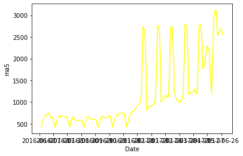
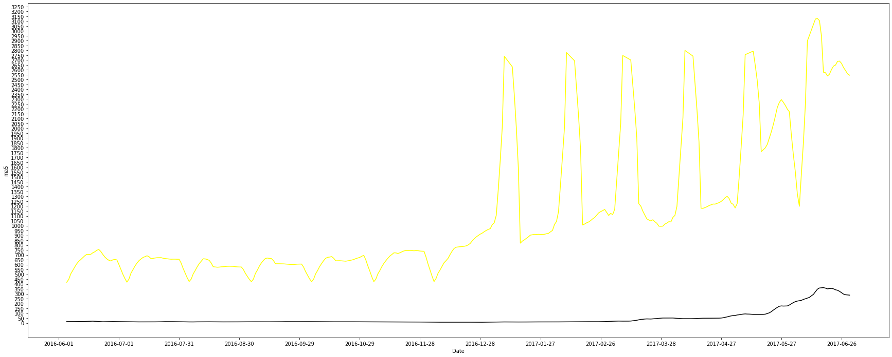

# 5일차 실습과제


```python
import numpy as np
import pandas as pd
import seaborn as sns
import matplotlib.pyplot as plt

%matplotlib inline
```


```python
nf = pd.read_csv('./netflix_titles.csv')
nf
```


<div>
<style scoped>
    .dataframe tbody tr th:only-of-type {
        vertical-align: middle;
    }

    .dataframe tbody tr th {
        vertical-align: top;
    }

    .dataframe thead th {
        text-align: right;
    }
</style>
<table border="1" class="dataframe">
  <thead>
    <tr style="text-align: right;">
      <th></th>
      <th>show_id</th>
      <th>type</th>
      <th>title</th>
      <th>director</th>
      <th>cast</th>
      <th>country</th>
      <th>date_added</th>
      <th>release_year</th>
      <th>rating</th>
      <th>duration</th>
      <th>listed_in</th>
      <th>description</th>
    </tr>
  </thead>
  <tbody>
    <tr>
      <th>0</th>
      <td>s1</td>
      <td>TV Show</td>
      <td>3%</td>
      <td>NaN</td>
      <td>João Miguel, Bianca Comparato, Michel Gomes, R...</td>
      <td>Brazil</td>
      <td>August 14, 2020</td>
      <td>2020</td>
      <td>TV-MA</td>
      <td>4 Seasons</td>
      <td>International TV Shows, TV Dramas, TV Sci-Fi &amp;...</td>
      <td>In a future where the elite inhabit an island ...</td>
    </tr>
    <tr>
      <th>1</th>
      <td>s2</td>
      <td>Movie</td>
      <td>7:19</td>
      <td>Jorge Michel Grau</td>
      <td>Demián Bichir, Héctor Bonilla, Oscar Serrano, ...</td>
      <td>Mexico</td>
      <td>December 23, 2016</td>
      <td>2016</td>
      <td>TV-MA</td>
      <td>93 min</td>
      <td>Dramas, International Movies</td>
      <td>After a devastating earthquake hits Mexico Cit...</td>
    </tr>
    <tr>
      <th>2</th>
      <td>s3</td>
      <td>Movie</td>
      <td>23:59</td>
      <td>Gilbert Chan</td>
      <td>Tedd Chan, Stella Chung, Henley Hii, Lawrence ...</td>
      <td>Singapore</td>
      <td>December 20, 2018</td>
      <td>2011</td>
      <td>R</td>
      <td>78 min</td>
      <td>Horror Movies, International Movies</td>
      <td>When an army recruit is found dead, his fellow...</td>
    </tr>
    <tr>
      <th>3</th>
      <td>s4</td>
      <td>Movie</td>
      <td>9</td>
      <td>Shane Acker</td>
      <td>Elijah Wood, John C. Reilly, Jennifer Connelly...</td>
      <td>United States</td>
      <td>November 16, 2017</td>
      <td>2009</td>
      <td>PG-13</td>
      <td>80 min</td>
      <td>Action &amp; Adventure, Independent Movies, Sci-Fi...</td>
      <td>In a postapocalyptic world, rag-doll robots hi...</td>
    </tr>
    <tr>
      <th>4</th>
      <td>s5</td>
      <td>Movie</td>
      <td>21</td>
      <td>Robert Luketic</td>
      <td>Jim Sturgess, Kevin Spacey, Kate Bosworth, Aar...</td>
      <td>United States</td>
      <td>January 1, 2020</td>
      <td>2008</td>
      <td>PG-13</td>
      <td>123 min</td>
      <td>Dramas</td>
      <td>A brilliant group of students become card-coun...</td>
    </tr>
    <tr>
      <th>...</th>
      <td>...</td>
      <td>...</td>
      <td>...</td>
      <td>...</td>
      <td>...</td>
      <td>...</td>
      <td>...</td>
      <td>...</td>
      <td>...</td>
      <td>...</td>
      <td>...</td>
      <td>...</td>
    </tr>
    <tr>
      <th>7782</th>
      <td>s7783</td>
      <td>Movie</td>
      <td>Zozo</td>
      <td>Josef Fares</td>
      <td>Imad Creidi, Antoinette Turk, Elias Gergi, Car...</td>
      <td>Sweden, Czech Republic, United Kingdom, Denmar...</td>
      <td>October 19, 2020</td>
      <td>2005</td>
      <td>TV-MA</td>
      <td>99 min</td>
      <td>Dramas, International Movies</td>
      <td>When Lebanon's Civil War deprives Zozo of his ...</td>
    </tr>
    <tr>
      <th>7783</th>
      <td>s7784</td>
      <td>Movie</td>
      <td>Zubaan</td>
      <td>Mozez Singh</td>
      <td>Vicky Kaushal, Sarah-Jane Dias, Raaghav Chanan...</td>
      <td>India</td>
      <td>March 2, 2019</td>
      <td>2015</td>
      <td>TV-14</td>
      <td>111 min</td>
      <td>Dramas, International Movies, Music &amp; Musicals</td>
      <td>A scrappy but poor boy worms his way into a ty...</td>
    </tr>
    <tr>
      <th>7784</th>
      <td>s7785</td>
      <td>Movie</td>
      <td>Zulu Man in Japan</td>
      <td>NaN</td>
      <td>Nasty C</td>
      <td>NaN</td>
      <td>September 25, 2020</td>
      <td>2019</td>
      <td>TV-MA</td>
      <td>44 min</td>
      <td>Documentaries, International Movies, Music &amp; M...</td>
      <td>In this documentary, South African rapper Nast...</td>
    </tr>
    <tr>
      <th>7785</th>
      <td>s7786</td>
      <td>TV Show</td>
      <td>Zumbo's Just Desserts</td>
      <td>NaN</td>
      <td>Adriano Zumbo, Rachel Khoo</td>
      <td>Australia</td>
      <td>October 31, 2020</td>
      <td>2019</td>
      <td>TV-PG</td>
      <td>1 Season</td>
      <td>International TV Shows, Reality TV</td>
      <td>Dessert wizard Adriano Zumbo looks for the nex...</td>
    </tr>
    <tr>
      <th>7786</th>
      <td>s7787</td>
      <td>Movie</td>
      <td>ZZ TOP: THAT LITTLE OL' BAND FROM TEXAS</td>
      <td>Sam Dunn</td>
      <td>NaN</td>
      <td>United Kingdom, Canada, United States</td>
      <td>March 1, 2020</td>
      <td>2019</td>
      <td>TV-MA</td>
      <td>90 min</td>
      <td>Documentaries, Music &amp; Musicals</td>
      <td>This documentary delves into the mystique behi...</td>
    </tr>
  </tbody>
</table>
<p>7787 rows × 12 columns</p>
</div>


# Mission 1. Netfilx and Code
## Mandatory Part
넷플릭스 데이터가 주어졌을 때, 다음 질문에 답하시오:

한국 작품은 총 얼마나 있는가?
country column을 기준으로 한다.
"South Korea"인 경우만 인정한다. ("US, South Korea"는 인정하지 않음)


```python
nf_country = nf['show_id'].groupby(by=nf['country'])
nf_count_country = nf_country.count()

print('한국 작품의 개수는 : {}'.format(nf_count_country.loc['South Korea']))
```

    한국 작품의 개수는 : 183
    

## Bonus Part
넷플릭스 데이터가 주어졌을 때, 다음 질문에 답하시오:

가장 많은 작품이 올라간 국가는 어디이고, 얼마나 많은 작품이 있는가?
country column을 기준으로 한다.
단일 국가인 경우를 기준으로 결과를 구해보자.


```python
nf_country = nf.groupby(nf['country']).count()
nf_country
# nf_count_country = nf_country.count()
re = nf_country.sort_values(by='show_id', ascending=False).head(1)

print('가장 많은 작품이 올라간 국가는 : {}, 작품 수는 : {}'.format(re.index[0], re['show_id'][0]))
```

    가장 많은 작품이 올라간 국가는 : United States, 작품 수는 : 2555
    

# Mission 2. 가즈아!

## Mandatory Part
다음 데이터가 주어졌을 때 2016.6 ~ 2017.6 기간의 5-MA(Moving Average) 비트코인 가격 그래프를 그려주세요.

선의 색깔은 노란색(#f2a900) 으로 해야합니다.
x-axis label과 y-axis label은 적절한 텍스트로 추가되어야 합니다.
이동평균의 기준은 Open Column으로 계산합니다.
이외에도 그래프를 알아보기 쉽게 하기 위한 정보(Text, Facet 등)을 추가하는 것도 좋습니다.
💡 이동평균(Moving Average)법은 시계열 데이터를 표현하는 데에 많이 사용하는 방법 중 하나입니다.


```python
bc = pd.read_csv('./BitCoin.csv')
bc
```


<div>
<style scoped>
    .dataframe tbody tr th:only-of-type {
        vertical-align: middle;
    }

    .dataframe tbody tr th {
        vertical-align: top;
    }

    .dataframe thead th {
        text-align: right;
    }
</style>
<table border="1" class="dataframe">
  <thead>
    <tr style="text-align: right;">
      <th></th>
      <th>Unnamed: 0</th>
      <th>Date</th>
      <th>Open</th>
      <th>High</th>
      <th>Low</th>
      <th>Close</th>
      <th>Volume</th>
      <th>Market Cap</th>
    </tr>
  </thead>
  <tbody>
    <tr>
      <th>0</th>
      <td>0</td>
      <td>2017-09-22</td>
      <td>3628.02</td>
      <td>3758.27</td>
      <td>3553.53</td>
      <td>3630.70</td>
      <td>1.194830e+09</td>
      <td>60152300000</td>
    </tr>
    <tr>
      <th>1</th>
      <td>1</td>
      <td>2017-09-21</td>
      <td>3901.47</td>
      <td>3916.42</td>
      <td>3613.63</td>
      <td>3631.04</td>
      <td>1.411480e+09</td>
      <td>64677600000</td>
    </tr>
    <tr>
      <th>2</th>
      <td>2</td>
      <td>2017-09-20</td>
      <td>3916.36</td>
      <td>4031.39</td>
      <td>3857.73</td>
      <td>3905.95</td>
      <td>1.213830e+09</td>
      <td>64918500000</td>
    </tr>
    <tr>
      <th>3</th>
      <td>3</td>
      <td>2017-09-19</td>
      <td>4073.79</td>
      <td>4094.07</td>
      <td>3868.87</td>
      <td>3924.97</td>
      <td>1.563980e+09</td>
      <td>67520300000</td>
    </tr>
    <tr>
      <th>4</th>
      <td>4</td>
      <td>2017-09-18</td>
      <td>3591.09</td>
      <td>4079.23</td>
      <td>3591.09</td>
      <td>4065.20</td>
      <td>1.943210e+09</td>
      <td>59514100000</td>
    </tr>
    <tr>
      <th>...</th>
      <td>...</td>
      <td>...</td>
      <td>...</td>
      <td>...</td>
      <td>...</td>
      <td>...</td>
      <td>...</td>
      <td>...</td>
    </tr>
    <tr>
      <th>1604</th>
      <td>1604</td>
      <td>2013-02-05</td>
      <td>116.38</td>
      <td>125.60</td>
      <td>92.28</td>
      <td>105.21</td>
      <td>6.722784e+06</td>
      <td>1292190000</td>
    </tr>
    <tr>
      <th>1605</th>
      <td>1605</td>
      <td>2013-01-05</td>
      <td>139.00</td>
      <td>139.89</td>
      <td>107.72</td>
      <td>116.99</td>
      <td>8.026719e+06</td>
      <td>1542820000</td>
    </tr>
    <tr>
      <th>1606</th>
      <td>1606</td>
      <td>2013-04-30</td>
      <td>144.00</td>
      <td>146.93</td>
      <td>134.05</td>
      <td>139.00</td>
      <td>8.312655e+06</td>
      <td>1597780000</td>
    </tr>
    <tr>
      <th>1607</th>
      <td>1607</td>
      <td>2013-04-29</td>
      <td>134.44</td>
      <td>147.49</td>
      <td>134.00</td>
      <td>144.54</td>
      <td>7.757951e+06</td>
      <td>1491160000</td>
    </tr>
    <tr>
      <th>1608</th>
      <td>1608</td>
      <td>2013-04-28</td>
      <td>135.30</td>
      <td>135.98</td>
      <td>132.10</td>
      <td>134.21</td>
      <td>7.806648e+06</td>
      <td>1500520000</td>
    </tr>
  </tbody>
</table>
<p>1609 rows × 8 columns</p>
</div>


```python
bc['Date'] = pd.to_datetime(bc['Date'])
# bc.query("Date >= '2016-6-1' and Date <= '2017-6-30'")
BC = bc[bc['Date'].isin(pd.date_range('2016-6-1', '2017-6-30'))].iloc[:, 1:3]
BC = BC.sort_values(by='Date')
BC
```


<div>
<style scoped>
    .dataframe tbody tr th:only-of-type {
        vertical-align: middle;
    }

    .dataframe tbody tr th {
        vertical-align: top;
    }

    .dataframe thead th {
        text-align: right;
    }
</style>
<table border="1" class="dataframe">
  <thead>
    <tr style="text-align: right;">
      <th></th>
      <th>Date</th>
      <th>Open</th>
    </tr>
  </thead>
  <tbody>
    <tr>
      <th>625</th>
      <td>2016-06-01</td>
      <td>431.86</td>
    </tr>
    <tr>
      <th>594</th>
      <td>2016-06-02</td>
      <td>386.59</td>
    </tr>
    <tr>
      <th>565</th>
      <td>2016-06-03</td>
      <td>400.52</td>
    </tr>
    <tr>
      <th>534</th>
      <td>2016-06-04</td>
      <td>424.28</td>
    </tr>
    <tr>
      <th>504</th>
      <td>2016-06-05</td>
      <td>447.94</td>
    </tr>
    <tr>
      <th>...</th>
      <td>...</td>
      <td>...</td>
    </tr>
    <tr>
      <th>88</th>
      <td>2017-06-26</td>
      <td>2590.57</td>
    </tr>
    <tr>
      <th>87</th>
      <td>2017-06-27</td>
      <td>2478.45</td>
    </tr>
    <tr>
      <th>86</th>
      <td>2017-06-28</td>
      <td>2553.03</td>
    </tr>
    <tr>
      <th>85</th>
      <td>2017-06-29</td>
      <td>2567.56</td>
    </tr>
    <tr>
      <th>84</th>
      <td>2017-06-30</td>
      <td>2539.24</td>
    </tr>
  </tbody>
</table>
<p>377 rows × 2 columns</p>
</div>


```python
BC['ma5'] = BC['Open'].rolling(window=5).mean()
BC
```


<div>
<style scoped>
    .dataframe tbody tr th:only-of-type {
        vertical-align: middle;
    }

    .dataframe tbody tr th {
        vertical-align: top;
    }

    .dataframe thead th {
        text-align: right;
    }
</style>
<table border="1" class="dataframe">
  <thead>
    <tr style="text-align: right;">
      <th></th>
      <th>Date</th>
      <th>Open</th>
      <th>ma5</th>
    </tr>
  </thead>
  <tbody>
    <tr>
      <th>625</th>
      <td>2016-06-01</td>
      <td>431.86</td>
      <td>NaN</td>
    </tr>
    <tr>
      <th>594</th>
      <td>2016-06-02</td>
      <td>386.59</td>
      <td>NaN</td>
    </tr>
    <tr>
      <th>565</th>
      <td>2016-06-03</td>
      <td>400.52</td>
      <td>NaN</td>
    </tr>
    <tr>
      <th>534</th>
      <td>2016-06-04</td>
      <td>424.28</td>
      <td>NaN</td>
    </tr>
    <tr>
      <th>504</th>
      <td>2016-06-05</td>
      <td>447.94</td>
      <td>418.238</td>
    </tr>
    <tr>
      <th>...</th>
      <td>...</td>
      <td>...</td>
      <td>...</td>
    </tr>
    <tr>
      <th>88</th>
      <td>2017-06-26</td>
      <td>2590.57</td>
      <td>2666.942</td>
    </tr>
    <tr>
      <th>87</th>
      <td>2017-06-27</td>
      <td>2478.45</td>
      <td>2624.426</td>
    </tr>
    <tr>
      <th>86</th>
      <td>2017-06-28</td>
      <td>2553.03</td>
      <td>2593.564</td>
    </tr>
    <tr>
      <th>85</th>
      <td>2017-06-29</td>
      <td>2567.56</td>
      <td>2559.372</td>
    </tr>
    <tr>
      <th>84</th>
      <td>2017-06-30</td>
      <td>2539.24</td>
      <td>2545.770</td>
    </tr>
  </tbody>
</table>
<p>377 rows × 3 columns</p>
</div>


```python
from datetime import datetime, timedelta
from matplotlib import rcParams


stdate = datetime.strptime('2016-06-01', '%Y-%m-%d')
eddate = datetime.strptime('2017-06-30', '%Y-%m-%d')
date_list = []
while stdate.strftime('%Y-%m-%d') <= eddate.strftime('%Y-%m-%d'):
    date_list.append(stdate.strftime('%Y-%m-%d'))
    stdate += timedelta(days=30)

    
Q = sns.lineplot(x=BC['Date'], y=BC['ma5'], color='yellow')
rcParams['figure.figsize'] = 30,12
Q.set_xticks(date_list)


plt.show()
```


    

    


## Bonus Part
위에 주어진 데이터와 더불어 다음 데이터도 주어졌을 때, 2016.6 ~ 2017.6 기간에 해당하는 비트코인의 5-MA 그래프와 이더리움의 5-MA 그래프를 동시에 그려주세요.

선의 색깔은 비트코인 : 노란색(#f2a900), 이더리움 : 검은색(#3c3c3d) 으로 해야합니다.
x-axis label과 y-axis label은 적절한 텍스트로 추가되어야 합니다.
이동평균의 기준은 Open Column으로 계산합니다.
이외에도 그래프를 알아보기 쉽게 하기 위한 정보(Text, Facet 등)을 추가하는 것도 좋습니다.


```python
et = pd.read_csv('./ETH_day.csv')
et
```


<div>
<style scoped>
    .dataframe tbody tr th:only-of-type {
        vertical-align: middle;
    }

    .dataframe tbody tr th {
        vertical-align: top;
    }

    .dataframe thead th {
        text-align: right;
    }
</style>
<table border="1" class="dataframe">
  <thead>
    <tr style="text-align: right;">
      <th></th>
      <th>Date</th>
      <th>Symbol</th>
      <th>Open</th>
      <th>High</th>
      <th>Low</th>
      <th>Close</th>
      <th>Volume ETH</th>
      <th>Volume USD</th>
    </tr>
  </thead>
  <tbody>
    <tr>
      <th>0</th>
      <td>2020-04-15</td>
      <td>ETHUSD</td>
      <td>158.61</td>
      <td>158.61</td>
      <td>158.61</td>
      <td>158.61</td>
      <td>0.00</td>
      <td>0.00</td>
    </tr>
    <tr>
      <th>1</th>
      <td>2020-04-14</td>
      <td>ETHUSD</td>
      <td>156.97</td>
      <td>162.15</td>
      <td>155.74</td>
      <td>158.61</td>
      <td>18061.58</td>
      <td>2872210.44</td>
    </tr>
    <tr>
      <th>2</th>
      <td>2020-04-13</td>
      <td>ETHUSD</td>
      <td>158.56</td>
      <td>159.51</td>
      <td>150.12</td>
      <td>156.97</td>
      <td>15698.32</td>
      <td>2416728.28</td>
    </tr>
    <tr>
      <th>3</th>
      <td>2020-04-12</td>
      <td>ETHUSD</td>
      <td>158.66</td>
      <td>165.37</td>
      <td>155.21</td>
      <td>158.56</td>
      <td>12877.33</td>
      <td>2082804.05</td>
    </tr>
    <tr>
      <th>4</th>
      <td>2020-04-11</td>
      <td>ETHUSD</td>
      <td>158.26</td>
      <td>161.49</td>
      <td>154.25</td>
      <td>158.66</td>
      <td>13761.72</td>
      <td>2172914.57</td>
    </tr>
    <tr>
      <th>...</th>
      <td>...</td>
      <td>...</td>
      <td>...</td>
      <td>...</td>
      <td>...</td>
      <td>...</td>
      <td>...</td>
      <td>...</td>
    </tr>
    <tr>
      <th>1433</th>
      <td>2016-05-13</td>
      <td>ETHUSD</td>
      <td>10.20</td>
      <td>11.59</td>
      <td>10.20</td>
      <td>10.69</td>
      <td>1769.71</td>
      <td>18923.55</td>
    </tr>
    <tr>
      <th>1434</th>
      <td>2016-05-12</td>
      <td>ETHUSD</td>
      <td>10.43</td>
      <td>12.00</td>
      <td>9.92</td>
      <td>10.20</td>
      <td>2072.56</td>
      <td>22183.39</td>
    </tr>
    <tr>
      <th>1435</th>
      <td>2016-05-11</td>
      <td>ETHUSD</td>
      <td>9.68</td>
      <td>10.47</td>
      <td>9.68</td>
      <td>10.43</td>
      <td>3052.51</td>
      <td>30978.11</td>
    </tr>
    <tr>
      <th>1436</th>
      <td>2016-05-10</td>
      <td>ETHUSD</td>
      <td>9.98</td>
      <td>9.98</td>
      <td>9.36</td>
      <td>9.68</td>
      <td>672.06</td>
      <td>6578.20</td>
    </tr>
    <tr>
      <th>1437</th>
      <td>2016-05-09</td>
      <td>ETHUSD</td>
      <td>12.00</td>
      <td>12.00</td>
      <td>9.36</td>
      <td>9.98</td>
      <td>1317.90</td>
      <td>12885.06</td>
    </tr>
  </tbody>
</table>
<p>1438 rows × 8 columns</p>
</div>


```python
et['Date'] = pd.to_datetime(et['Date'])
# bc.query("Date >= '2016-6-1' and Date <= '2017-6-30'")
ET = et[et['Date'].isin(pd.date_range('2016-6-1', '2017-6-30'))].loc[:, ['Date', 'Open']]

ET = ET.sort_values(by='Date')
ET
```


<div>
<style scoped>
    .dataframe tbody tr th:only-of-type {
        vertical-align: middle;
    }

    .dataframe tbody tr th {
        vertical-align: top;
    }

    .dataframe thead th {
        text-align: right;
    }
</style>
<table border="1" class="dataframe">
  <thead>
    <tr style="text-align: right;">
      <th></th>
      <th>Date</th>
      <th>Open</th>
    </tr>
  </thead>
  <tbody>
    <tr>
      <th>1414</th>
      <td>2016-06-01</td>
      <td>14.18</td>
    </tr>
    <tr>
      <th>1413</th>
      <td>2016-06-02</td>
      <td>13.95</td>
    </tr>
    <tr>
      <th>1412</th>
      <td>2016-06-03</td>
      <td>13.90</td>
    </tr>
    <tr>
      <th>1411</th>
      <td>2016-06-04</td>
      <td>14.02</td>
    </tr>
    <tr>
      <th>1410</th>
      <td>2016-06-05</td>
      <td>13.86</td>
    </tr>
    <tr>
      <th>...</th>
      <td>...</td>
      <td>...</td>
    </tr>
    <tr>
      <th>1024</th>
      <td>2017-06-26</td>
      <td>278.73</td>
    </tr>
    <tr>
      <th>1023</th>
      <td>2017-06-27</td>
      <td>253.00</td>
    </tr>
    <tr>
      <th>1022</th>
      <td>2017-06-28</td>
      <td>286.21</td>
    </tr>
    <tr>
      <th>1021</th>
      <td>2017-06-29</td>
      <td>317.59</td>
    </tr>
    <tr>
      <th>1020</th>
      <td>2017-06-30</td>
      <td>293.80</td>
    </tr>
  </tbody>
</table>
<p>395 rows × 2 columns</p>
</div>


```python
ET['ma5'] = ET['Open'].rolling(window=5).mean()
ET
```


<div>
<style scoped>
    .dataframe tbody tr th:only-of-type {
        vertical-align: middle;
    }

    .dataframe tbody tr th {
        vertical-align: top;
    }

    .dataframe thead th {
        text-align: right;
    }
</style>
<table border="1" class="dataframe">
  <thead>
    <tr style="text-align: right;">
      <th></th>
      <th>Date</th>
      <th>Open</th>
      <th>ma5</th>
    </tr>
  </thead>
  <tbody>
    <tr>
      <th>1414</th>
      <td>2016-06-01</td>
      <td>14.18</td>
      <td>NaN</td>
    </tr>
    <tr>
      <th>1413</th>
      <td>2016-06-02</td>
      <td>13.95</td>
      <td>NaN</td>
    </tr>
    <tr>
      <th>1412</th>
      <td>2016-06-03</td>
      <td>13.90</td>
      <td>NaN</td>
    </tr>
    <tr>
      <th>1411</th>
      <td>2016-06-04</td>
      <td>14.02</td>
      <td>NaN</td>
    </tr>
    <tr>
      <th>1410</th>
      <td>2016-06-05</td>
      <td>13.86</td>
      <td>13.982</td>
    </tr>
    <tr>
      <th>...</th>
      <td>...</td>
      <td>...</td>
      <td>...</td>
    </tr>
    <tr>
      <th>1024</th>
      <td>2017-06-26</td>
      <td>278.73</td>
      <td>310.850</td>
    </tr>
    <tr>
      <th>1023</th>
      <td>2017-06-27</td>
      <td>253.00</td>
      <td>296.592</td>
    </tr>
    <tr>
      <th>1022</th>
      <td>2017-06-28</td>
      <td>286.21</td>
      <td>289.898</td>
    </tr>
    <tr>
      <th>1021</th>
      <td>2017-06-29</td>
      <td>317.59</td>
      <td>288.066</td>
    </tr>
    <tr>
      <th>1020</th>
      <td>2017-06-30</td>
      <td>293.80</td>
      <td>285.866</td>
    </tr>
  </tbody>
</table>
<p>395 rows × 3 columns</p>
</div>


```python
Q = sns.lineplot(x=BC['Date'], y=BC['ma5'], color='yellow')
Q = sns.lineplot(x=ET['Date'], y=ET['ma5'], color='black')
rcParams['figure.figsize'] = 30,20
Q.set_xticks(date_list)
Q.set_yticks([i for i in range(0, 3300, 50)])
plt.show()
```


    

    

